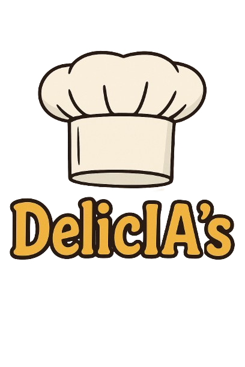

# DelicIA’S

---

  
Introducción

	 
DelicIA’s es una plataforma de recetas de cocina que integra inteligencia artificial. Los usuarios ingresan ingredientes o preferencias (por ejemplo, “pollo y brócoli, cena ligera”) y la IA genera una receta personalizada con pasos, tiempos y consejos.

Nuestro objetivo en este proyecto es desarrollar nuestros conocimientos sobre la IA y las WEBs ya que nos da curiosidad porque las usamos casi diariamente. También nos hace ilusión saber que somos capaces de hacer algo así y si en un futuro puede ser útil para la gente mejor, en un principio nos lo tomamos como un proyecto para estudiar pero estaría bien ver hasta dónde podemos llegar desarrollando nuestra idea.

---

  
Briefing de ideas

	 
  Principalmente nosotros teníamos un par de ideas, entre ellas estaba hacer una página web que sirviera para estudiar los diferentes tipos de carnets de conducir pero hablando con los profesores y valorando nuestras ideas vimos que teníamos un alto porcentaje de que a mediados del proyecto este se nos pudiera cancelar por culpa de permisos que teniamos que solicitar de la DGT cosa que nosotros no podíamos hacer nada, entonces fuimos a algo más difícil pero que nos gusta más ya que la idea es más innovadora, queríamos hacer una IA desde cero y entrenarla para hacer recetas, pero al final hemos decidido coger una Ia ya hecha y entrenarla porque hacerla desde cero se nos complica y no tenemos los conocimientos suficientes.

Para poder desarrollar nuestro proyecto principalmente vamos a necesitar una plantilla de una IA para poderla entrenar para lo que querramos que responda y con que lenguaje y también una plantilla de una página web, cosa que ambas ya las tenemos a la mano, la plantilla de la página web estamos decidiendo cuál nos gusta más y nos va ser más útil. También necesitamos organizar todo de una manera adecuada para no liarnos, esto lo conseguiremos haciendo una bibliografía, desarrollar bien el trello con la información bien puesta.

- Desarrollar una web funcional y atractiva con una interfaz moderna y adaptable.
  
- Implementar un sistema de registro y autenticación de usuarios

- Permitir la publicación, valoración y almacenamiento de recetas

- Crear una sección de “favoritos” y otra de “recetas destacadas”.

- Integrar una IA funcional o simulada que interactúe con el usuario y recomiende recetas.

- Diseñar una arquitectura cliente-servidor estable con base de datos relacional.

- Documentar el proyecto en GitHub.   

---

  
Arquitectura del software

	 

	

Diagrama De Gantt

 
Un diseño de Gantt es una tabla o gráfico que muestra las tareas de un proyecto colocadas en una línea de tiempo, indicando cuándo empiezan, cuándo terminan y cuánto duran. Es útil para un proyecto porque permite ver de forma clara la planificación, organizar el trabajo por fases, detectar retrasos y controlar el avance. Gracias al diagrama de Gantt, es más fácil gestionar el proyecto y asegurarse de que todo se haga a tiempo.
 

	

 

[Diagrama de Gantt DelicIA's](https://docs.google.com/spreadsheets/d/1v8SxtipMUR5VIm4CUHCaQV0vc51-1jquD_x6YIupjv8/edit?usp=sharing)
	

	
Estudio De La Base De Datos
	
	 
     
	
**¿Qué funcionalidades ofrecerá a los usuarios?**
	
- Los usuarios podrán acceder al registro o inicio de sesión.
- Búsqueda de recetas generadas por una IA.
- Almacenar recetas favoritas y las que te gusten.
- Poner reseñas de las recetas, sugerir ingredientes, (vegano, sin gluten, etc.). 
- Opción de generar imágenes del plato (IA de imágenes).
- Búsqueda de recetas por filtros.
   
   
  
**¿Qué tema de información almacena?**
	
- Los datos de cada persona registrada.
- Información de cada receta generada.
- Lista de ingredientes. 
- Opiniones de los usuarios.
- Puntuaciones.
- Relación usuario receta.
   
   

**¿Por qué necesitas guardarla en la base de datos?**

- Control de acceso.
- Personalización de recetas.
- Historial de la web
- Guardar las recetas para consultas posteriores y permitir que otros usuarios las vean.
- Estandarizar ingredientes para búsquedas y filtrados.
- Permitir feedback y participación en cada receta.
- Calificar recetas y mostrar ranking.
- Que cada usuario pueda marcar recetas como favoritas.

 

### DATOS QUE ALMACENA CADA ENTIDAD

 

**Tabla: Usuarios**

Esta tabla “Usuarios” almacena la información básica de los usuarios de un sistema, donde cada usuario tiene un ID único, nombre, email único, contraseña en formato hash y la fecha en que se registró.

<table>
  <tr>
    <th style="width: 200px;">ATRIBUTOS</th>
    <th style="width: 100px;">TIPOS DE DATOS</th>
  </tr>
  <tr>
    <td>ID Usuario</td>
    <td>INT,PK,AUTO_INCREMENT</td>
  </tr>
  <tr>
    <td>Nombre</td>
    <td>VARCHAR 100</td>
  </tr>
  <tr>
	<td>Email</td>
	<td>VARCHAR 150, ÚNICO</td>
  </tr>
  <tr>
	<td>Contraseña Hash</td>
	<td>VARCHAR 255</td>
  </tr>
  <tr>
	<td>Fecha De Registro</td>
	<td>DATETIME</td>
</table>
 
 

**Tabla: Recetas**
 

Esta Tabla guarda las recetas con título, descripción, pasos, imagen opcional, usuario que la creó y fecha de creación.
<table>
  <tr>
    <th style="width: 200px;">ATRIBUTOS</th>
    <th style="width: 100px;">TIPOS DE DATOS</th>
  </tr>
  <tr>
    <td>ID Receta</td>
    <td>INT,PK</td>
  </tr>
  <tr>
    <td>Título</td>
    <td>VARCHAR 150</td>
  </tr>
  <tr>
	<td>Descripción</td>
	<td>TEXT</td>
  </tr>
  <tr>
	<td>Pasos</td>
	<td>TEXT</td>
  </tr>
  <tr>
	<td>Imagen URL</td>
	<td>VARCHAR 255, opcional si se genera una imagen.</td>
  </tr>
  <tr>
	<td>Id Usuario</td>
	<td>INT, FK</td>
  </tr>
  <tr>
	<td>Fecha De Creación</td>
	<td>DATETIME</td>
</table>
 
 

**Tabla: Ingredientes**

Contiene los ingredientes disponibles, con nombre y tipo.

<table>
  <tr>
    <th style="width: 200px;">ATRIBUTOS</th>
    <th style="width: 100px;">TIPOS DE DATOS</th>
  </tr>
  <tr>
    <td>ID Ingrediente</td>
    <td>INT,PK</td>
  </tr>
  <tr>
    <td>Nombre</td>
    <td>VARCHAR 100</td>
  </tr>
  <tr>
	<td>Tipo</td>
	<td>VARCHAR 50</td>
</table>
 
 

**Tabla: Receta_Ingrediente**

Relaciona recetas con sus ingredientes y la cantidad necesaria de cada uno.

<table>
  <tr>
    <th style="width: 200px;">ATRIBUTOS</th>
    <th style="width: 100px;">TIPOS DE DATOS</th>
  </tr>
  <tr>
    <td>ID Receta</td>
    <td>INT,FK</td>
  </tr>
  <tr>
    <td>ID Ingrediente</td>
    <td>INT, FK</td>
  </tr>
  <tr>
	<td>Cantidad</td>
	<td>VARCHAR 50   EJ: "2 cucharadas"</td>
</table>

**Comentarios**

<table>
  <tr>
    <th style="width: 200px;">ATRIBUTOS</th>
    <th style="width: 100px;">TIPOS DE DATOS</th>
  </tr>
  <tr>
    <td>ID Comentario</td>
    <td>INT,PK</td>
  </tr>
  <tr>
    <td>ID receta</td>
    <td>INT, FK</td>
  </tr>
  <tr>
	<td>ID Usuario</td>
	<td>INT, FK</td>
  </tr>
  <tr>
	<td>Texto</td>
	<td>TEXT</td>
  </tr>
  <tr>
	<td>Fecha</td></td>
	<td>DATETIME</td>
</table>

**Tabla: Valoraciones**

<table>
  <tr>
    <th style="width: 200px;">ATRIBUTOS</th>
    <th style="width: 100px;">TIPOS DE DATOS</th>
  </tr>
  <tr>
    <td>ID Valoración</td>
    <td>INT,PK</td>
  </tr>
  <tr>
    <td>ID receta</td>
    <td>INT, FK</td>
  </tr>
  <tr>
	<td>ID Usuario</td>
	<td>INT, FK</td>
  </tr>
  <tr>
	<td>Puntuación</td>
	<td>INT(1)</td>
</table>

**FAVORITOS**
<table>
  <tr>
    <th style="width: 200px;">ATRIBUTOS</th>
    <th style="width: 100px;">TIPOS DE DATOS</th>
  </tr>
  <tr>
    <td>ID Favorito</td>
    <td>INT,PK</td>
  </tr>
  <tr>
    <td>ID receta</td>
    <td>INT, FK</td>
  </tr>
  <tr>
	<td>ID Usuario</td>
	<td>INT, FK</td>
  </tr>
  <tr>
	<td>Texto</td>
	<td>TEXT</td>
  </tr>
  <tr>
	<td>Fecha Guardado</td></td>
	<td>DATETIME</td>
</table>

### 4. Relaciones entre las entidades
**¿Cómo se relacionan unas entidades con otras?**

Usuario – Receta: 
Un usuario puede crear muchas recetas, pero cada receta pertenece a un solo usuario.

Receta – Ingrediente:
 Una receta tiene muchos ingredientes y un ingrediente puede usarse en muchas recetas.

Receta – Comentarios: 
Cada receta puede tener muchos comentarios, pero cada comentario está asociado a una sola receta.

Receta – Valoraciones : 
Cada receta puede recibir muchas valoraciones, pero cada valoración pertenece a una sola receta.

Favoritos: Recetas_fav_Usuarios: 
Un usuario puede tener muchas recetas favoritas, y una receta puede ser favorita de muchos usuarios.

### 5. Ejemplo de datos

**USUARIO**

<table>
  <tr>
    <th style="width: 200px;">ID_USUARIO</th>
    <th style="width: 100px;">NOMBRE</th>
    <th style="width: 100px;">GMAIL</th>
    <th style="width: 100px;">REGISTRO</th>
  </tr>
  <tr>
    <td>1</td>
    <td>Hector Abad</td>
    <td>Hector555@gmail.com</td>
    <td>30-09-2025</td>
</table>

**RECETAS**
<table>
  <tr>
    <th style="width: 200px;">ID_RECETA</th>
    <th style="width: 100px;">NOMBRE RECETA</th>
    <th style="width: 100px;">DESCRIPCIÓN</th>
    <th style="width: 100px;">PASOS</th>
    <th style="width: 100px;">ID_USUARIO</th>
	<th style="width: 100px;">FECHA CREACIÓN</th>
  </tr>
  <tr>
    <td>1</td>
    <td>Macarrones</td>
    <td>Cocina Rápida</td>
    <td>1. Hervir los macarrones, 2. escurrirlos</td>
	<td>1</td>
	<td>30-09-2025</td>
</table>

**INGREDIENTES**
<table>
  <tr>
    <th style="width: 200px;">ID_INGREDIENTE</th>
    <th style="width: 100px;">NOMBRE</th>
    <th style="width: 100px;">TIPO</th>
  </tr>
  <tr>
    <td>1</td>
    <td>Macarrones</td>
    <td>Pasta</td>
  </tr>
  <tr>
    <td>2</td>
	<td>Tomate</td>
	<td>Salsa</td>
</table>

**CANTIDAD**
<table>
  <tr>
    <th style="width: 200px;">ID_RECETA</th>
    <th style="width: 100px;">ID_INGREDIENTE</th>
    <th style="width: 100px;">CANTIDAD</th>
  </tr>
  <tr>
    <td>1</td>
    <td>1</td>
    <td>200G</td>
  </tr>
  <tr>
    <td>1</td>
	<td>2</td>
	<td>10G</td>
</table>

**COMENTARIOS**
<table>
  <tr>
    <th style="width: 200px;">ID_COMENTARIO</th>
    <th style="width: 100px;">ID_RECETA</th>
    <th style="width: 100px;">ID_USUARIO</th>
	<th style="width: 100px;">TEXTO</th>
    <th style="width: 100px;">FECHA</th>
  </tr>
  <tr>
    <td>1</td>
    <td>1</td>
    <td>1</td>
	<td>Rico Y Rápido</td>
	<td>30-09-2025</td>
</table>

**VALORACIONES**
<table>
  <tr>
    <th style="width: 200px;">ID_VALORACIÓN</th>
    <th style="width: 100px;">ID_RECETA</th>
    <th style="width: 100px;">ID_USUARIO</th>
	<th style="width: 100px;">PUNTUACIÓN</th>
  </tr>
  <tr>
    <td>1</td>
    <td>1</td>
    <td>1</td>
	<td>5</td>
</table>

### 6. Reflexiones, dificultades y dudas que tienes sobre la base de datos

**Decisión sobre recetas IA:**
 Guardar la receta generada para no perder resultados buenos, en vez de generarla en vivo cada vez.
**Imágenes:**

Explicación 
Tabla correspondiente
  

---

  
Tecnologías a utilizar

 
	
## Seguridad y Conectividad

### pfSense:

 Es el router y el firewall principal. Vigila todo el tráfico que viene de Internet y decide qué entra a nuestra red interna. Ofrece protección perimetral, hace la traducción de direcciones (NAT) y permite crear túneles seguros (VPN).

### Cloudflare:

Gestiona el DNS para que el nombre delicias.tallerdekirby.es se traduzca a una IP, actúa como CDN hace que la web cargue más rápido y nos protege de ataques grandes de denegación de servicio DDoS.

### DHCP:
El DHCP reparte las direcciones IP automáticamente a todos los dispositivos de la red. Esto evita errores de configuración manual.
   
## Servicios Web y Servidores
  
Estos son los equipos que hacen que la web funcione y guardan los datos:

### Servidor Web (Apache con PHP/HTML/CSS):
- Apache se encarga de servir las páginas.
- PHP ejecuta la lógica dinámica 
- HTML/CSS son el esqueleto y el diseño de la web.

### Servidor de Base de Datos (MySQL):
- Es el archivador central. Guarda todos los datos dinámicos de la web.

### TrueNAS:
- Es un servidor NAS . Su función es proporcionar una solución centralizada de almacenamiento para backups y archivos importantes.

### Pi-hole:
- Funciona como un servidor DNS interno que tiene una lista negra. Su objetivo es bloquear toda la publicidad y rastreadores antes de que lleguen a los dispositivos, mejorando la velocidad y la privacidad de la navegación.

[Tecnologias A Utilizar](https://docs.google.com/spreadsheets/d/1jvCkxkATXNUpnb44VIDi7ZuNaSH9dxMkMCZxkB0eU-Q/edit?usp=sharing)

---

  
Red

   

  
Diagrama De La Red

	 
Un diagrama de red es un dibujo que muestra cómo están conectadas todas las partes de un proyecto, como tareas, actividades y el orden en que deben hacerse. Es importante porque ayuda a ver claramente qué depende de qué, permite organizar mejor el trabajo, identificar posibles retrasos y planificar el tiempo de manera más realista. Con este diagrama es más fácil entender el proyecto completo y tomar decisiones para que todo avance sin problemas.
	 

 

  
Mapa Físico

 

  
Mapa Lógico

---

  
Web

 

  
a. Teoría Del Color DelicIA's

 
	
## 🎨 Teoría del color de la web DeliciA’s

La web utiliza una paleta cálida y alegre, pensada para despertar el apetito y transmitir una sensación acogedora y cercana. Los tonos principales están inspirados en el mundo de la cocina y los ingredientes frescos, generando una experiencia visual agradable y coherente.

<table>
  <tr>
    <th style="width: 200px;">Color</th>
    <th style="width: 100px;">Código</th>
    <th style="width: 100px;">Uso Principal</th>
    <th style="width: 100px;">Significado</th>
  </tr>
  <tr>
    <td>🟨 Amarillo claro</td>
    <td>#FEE070</td>
    <td>Fondo principal y cabecera</td>
    <td>Representa energía y apetito. Es el color protagonista y da identidad a la web.</td>
  <tr>
	<td>⚫ Negro
	<td>#000000
	<td>Texto y bordes
	<td>Aporta contraste, claridad y elegancia, facilitando la lectura.
  <tr>
	<td>⚪ Blanco
	<td>#FFFFFF
	<td>Fondo de secciones y tarjetas
	<td>Da equilibrio a la web, limpieza visual y resalta las imágenes de los platos.
  <tr>
	<td>🟦 Azul medio
	<td>#3A8DFF (aprox.)
	<td>Botones de login y registro
	<td>Transmite confianza y profesionalidad, creando contraste con el amarillo.
  <tr>
	<td>🟫 Gris claro
	<td>#D9D9D9
	<td>Botones de categorías (“Otros”)
	<td>Neutraliza el conjunto, ayudando al equilibrio visual.
</table>

## Análisis general

El color amarillo crea una ambiente cálido, ideal para una web de cocina. La combinación que hemos usado con el negro mejora la legibilidad y añade un toque moderno. El blanco y los tonos grises sirven para dar respiro visual, mientras que los detalles en azul rompen la monotonía y guían la atención hacia acciones importantes como iniciar sesión o registrarse.

La paleta en conjunto comunica alegría, hemos intentado usar los colores para hacer que el usuario se sienta cómodo mientras explora las recetas.
 
 

 

 

  
b. Diseño y Mockup

 

 
La página principal de DelicIA’s da una bienvenida cálida y moderna al usuario. Nuestro color amarillo domina el diseño, transmitiendo energía y apetito, mientras que el fondo con fotos de comida crea un ambiente fresco y apetecible. El logo con el gorro de chef y la palabra “IA” refleja la mezcla entre cocina y tecnología. En la parte superior, el menú permite navegar fácilmente entre recetas, valoraciones y platos destacados, y los botones Login y Registro invitan a unirse a la comunidad. En el centro, el gran título “DelicIA’s” y el mensaje “Aprende a cocinar con nosotros”, acompañado por una barra de búsqueda que anima a explorar recetas de forma rápida y sencilla con la Inteligencia Artificial.	
 
 
	

 

Esta pantalla de inicio de sesión mantiene la estética general de DelicIA’s, con el fondo de comida saludable y el color amarillo que se conserva en todas las páginas de la web para darle coherencia. En el centro, un recuadro redondeado destaca sobre el fondo, creando un espacio limpio y visualmente agradable donde se observa claramente que és el inicio de sesión del usuario, unos botones en los que ingresar el correo y la contraseña. Los iconos dentro de los campos, y el botón gris de “Iniciar sesión” junto con la opción de acceder con Google ofrecen una entrada rápida y moderna. En la parte inferior, los enlaces para recuperar la contraseña o registrarse están bien ubicados para guiar al usuario según su necesidad. En conjunto, esta página mantiene un diseño simple, funcional y coherente con la identidad visual de DelicIA’s.
 
 

La página del apartado de Registro es practicamente la misma que la de Inicio de sesión. Los campos para ingresar usuario, contraseña y confirmación están acompañados de iconos que hacen más intuitivo el proceso. El botón gris de “Registrarse” es claro y accesible, y la opción de registro con Google agiliza el acceso para los usuarios. Al final, el enlace “¿Ya tienes cuenta? Iniciar sesión” ofrece una navegación fluida entre las dos pantallas principales. En conjunto, esta página mantiene la misma calidez y simplicidad que caracteriza a toda la web.
 
 

La página web de DeliciA’s usa los mismos colores que las anteriores, con un fondo amarillo que da sensación de alegría y energía, haciendo que todo se vea coherente y atractivo. El diseño es sencillo, y lo que más llama la atención son las fotos de los platos, que son el centro de la página.En la parte de arriba hay un menú que permite entrar fácilmente a las recetas, valoraciones o favoritos. Los botones azules para iniciar sesión y registrarse se notan mucho por el contraste, y se mantienen para mostrar que esas son las pocas cosas
que se pueden hacer sin iniciar sesión. Las imágenes de comida tienen un efecto que, al pasar el ratón por encima, muestra el nombre del plato e invita a saber más.
En general, la web se ve ordenada, cálida y apetecible, perfecta para una página de cocina moderna y fácil de usar. El objetivo de esta página es mostrar recetas creadas por otros usuarios o por la Inteligencia Artificial, con la idea de que alguna receta le guste al usuario.
 
 

En esta parte de la web, los usuarios pueden ver las fotos de las recetas, su valoración y los comentarios, a los que se accede con el botón “Ver Opiniones”, que es amarillo con letras negras. Cada plato muestra una puntuación dentro de un recuadro con una estrella, lo que permite comparar fácilmente cuál es el más popular. El diseño es sencillo y ordenado, con imágenes grandes que facilitan explorar, elegir una receta, valorarla o guardarla como favorita. En general, la página mantiene un estilo moderno, visual y coherente, que invita a participar y disfrutar del contenido de cocina.
 
 

Esta página de DeliciA’s usa los mismos colores que las anteriores, con un fondo amarillo que mantiene la coherencia y da una sensación alegre. Aquí se muestran los platos más destacados, una selección de recetas populares por su buen sabor y por ser fáciles de preparar. El título y el texto de introducción explican claramente el propósito de la sección, animando al usuario a descubrir opciones sencillas y deliciosas. Cada imagen de plato tiene un botón amarillo con el texto “Ver Receta”, que destaca e invita a hacer clic. El diseño es limpio y ordenado, con las imágenes bien colocadas y centradas, lo que hace que la navegación sea fácil y mantiene el estilo moderno, atractivo y apetecible de toda la web.
 
 

Aquí el usuario encuentra las recetas, presentadas con una foto atractiva, el nombre del plato y el tiempo de preparación. Cada tarjeta permite acceder al detalle de la receta, donde se pueden ver los ingredientes, los pasos, la descripción y las reseñas. En la parte superior hay una barra de búsqueda manual y un botón de filtros a la derecha, pensados para encontrar más recetas de forma rápida y personalizada. En conjunto, la página es práctica, clara y visualmente agradable, ideal para explorar y organizar las recetas guardadas.
 
 

En este apartado, el usuario puede ver todos los platos que ha guardado como favoritos, con una presentación ordenada que muestra la imagen del plato, su nombre y el tiempo estimado de preparación. Cada receta se puede abrir para ver su descripción, los ingredientes, los pasos y las opiniones de otros usuarios. En la parte superior, hay una barra de búsqueda y un botón de filtros que ayudan a encontrar recetas específicas o a clasificarlas según las preferencias del usuario. En conjunto, la página transmite orden, facilidad de uso y una estética atractiva que invita a seguir explorando nuevas recetas.
 
 

En esta página, el usuario puede explorar otras categorías de recetas, como platos veganos, saludables, de horno, platos de cuchara o postres, lo que facilita encontrar exactamente el tipo de receta que busca. Cada categoría está representada por un botón gris con bordes redondeados y texto negro, lo que da una apariencia limpia y fácil de leer. La organización en filas y columnas hace que la navegación sea rápida e intuitiva, manteniendo la estética clara, práctica y coherente con el resto de la web.
 
 

 

  
c. Mapa De Navegabilidad

	 
Un mapa de navegabilidad es un dibujo que muestra cómo se conectan entre sí las distintas pantallas o secciones de una aplicación o página web. Es importante porque permite ver de un vistazo cómo se moverá el usuario dentro del sistema, ayuda a organizar mejor la información y a detectar si hay pasos confusos o innecesarios. Gracias a este mapa, es más fácil planificar un diseño claro y sencillo que mejore la experiencia del usuario.
	 
	

	
[Mapa De Navegabilidad Figma](https://www.figma.com/design/upHGaQZQPooRiEkaitpQMz/Sin-t%C3%ADtulo?node-id=0-1&p=f&t=nfCwLF66udVG8ufu-0)
	

 

  
d. BackEnd

	
## Antes

## Después

---

  
Servicios

 

  
a. DNS

 
El DNS es un servicio que se encarga de traducir los nombres de las páginas web, como ejemplo.com, a direcciones numéricas que los ordenadores entienden. Es útil para un proyecto porque permite que los usuarios accedan fácilmente a tu página o aplicación usando un nombre sencillo en lugar de una dirección difícil de recordar. Gracias al DNS, el acceso es más rápido, más claro y más profesional.

 

  
b. DHCP

 
El DHCP es un servicio que asigna automáticamente direcciones IP y otros datos de red a los dispositivos cuando se conectan. Es útil para un proyecto porque evita tener que configurar cada equipo a mano, reduce errores y hace que la red funcione de forma rápida y ordenada. Gracias al DHCP, todos los dispositivos pueden conectarse y comunicarse sin complicaciones.

 

  
c. Apache

	  
Apache es un programa que funciona como servidor web, se encarga de entregar las páginas y recursos de un sitio cuando un usuario los solicita desde su navegador. Es útil para un proyecto porque permite publicar una web o aplicación de forma segura y estable, gestionar el acceso de los usuarios y asegurar que el contenido se cargue correctamente. Con Apache, tu proyecto puede estar disponible para cualquiera que necesite acceder a él desde internet o desde una red local.

 

  
d. Firewall

 
Un firewall es un sistema que controla qué tráfico puede entrar o salir de una red, actuando como una especie de “muro de seguridad” que bloquea accesos no autorizados. Es útil para un proyecto porque protege los equipos y datos de ataques, virus y conexiones sospechosas, asegurando que solo pasen las comunicaciones permitidas. Gracias al firewall, el proyecto funciona de forma más segura y estable.

 

  
e. Copias De Seguridad

 
Las copias de seguridad son duplicados de los archivos y datos importantes que se guardan en otro lugar para no perderlos si ocurre un fallo, un borrado accidental o un ataque informático. Son útiles para un proyecto porque garantizan que, pase lo que pase, siempre podrás recuperar la información necesaria y continuar trabajando sin perder tiempo ni contenido.

---

  
Conclusiones

---

  
Bibliografia

	 
	<a href="https://www.youtube.com/watch?v=44ziZ12rJwU">¿Como usar GitHub? </a>
	 
	<a href="https://www.llama.com/llama-downloads/">API Meta Llama (IA) </a>
	 
	<a href="https://v2.auth.mistral.ai/login?flow=9a02f924-90cd-4698-b4ef-059d93d6ef3a"> API Mistral (IA) </a>
	 
	<a href="https://www.youtube.com/watch?v=SmNsfs1x92Y"> ¿Como crear carrusel? <a/>
	 
	<a href="https://developer.mozilla.org/en-US/docs/Web/CSS/Reference/Properties/border-block-color"> Referencia para comandos HTML/CSS/JAVAScript </a>
	 
	<a href="https://icons.getbootstrap.com/?q=login"> Logos Bootstrap </a>
	 
	<a href="https://kinsta.com/es/blog/contorno-texto-css/"> Comandos CSS </a>
	 
	<a href="https://startbootstrap.com/themes#google_vignette"> Plantillas Webs </a>
	

